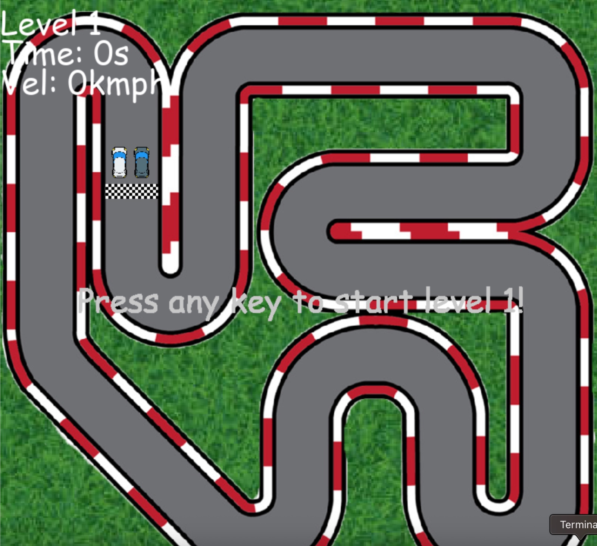
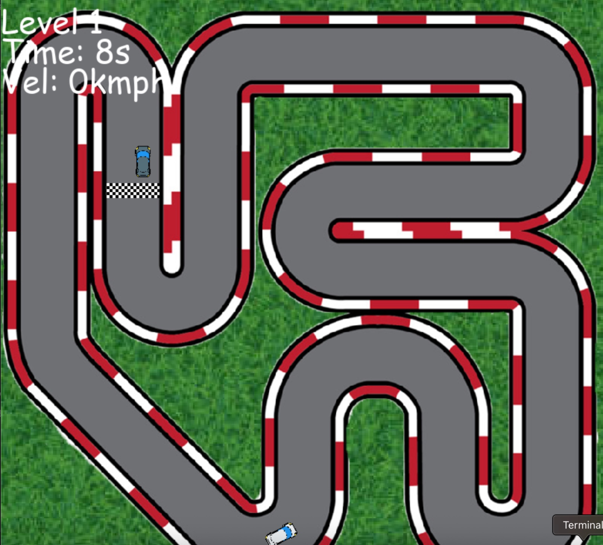

# Racing Game
This project is a 2D top-down racing game 
built using the Pygame library. Players race against a 
computer-controlled car across multiple levels, avoiding 
track boundaries and aiming to reach the finish line first.

## Features
- Single-player mode against AI with increasing difficulty
- Realistic car movement with acceleration, deceleration, and collisions
- Level progression system with timed performance tracking
- Smooth graphics and animations for immersive gameplay

1.**Game Start Screen**

2.**In-Game Racing**

## Technologies Used 
1. Python 3.12.3 
2. Pygame 2.6.1

## Controls
- Press any key to start
- W: Accelerate
- S: Reverse
- A: Steer Left
- D: Steer Right